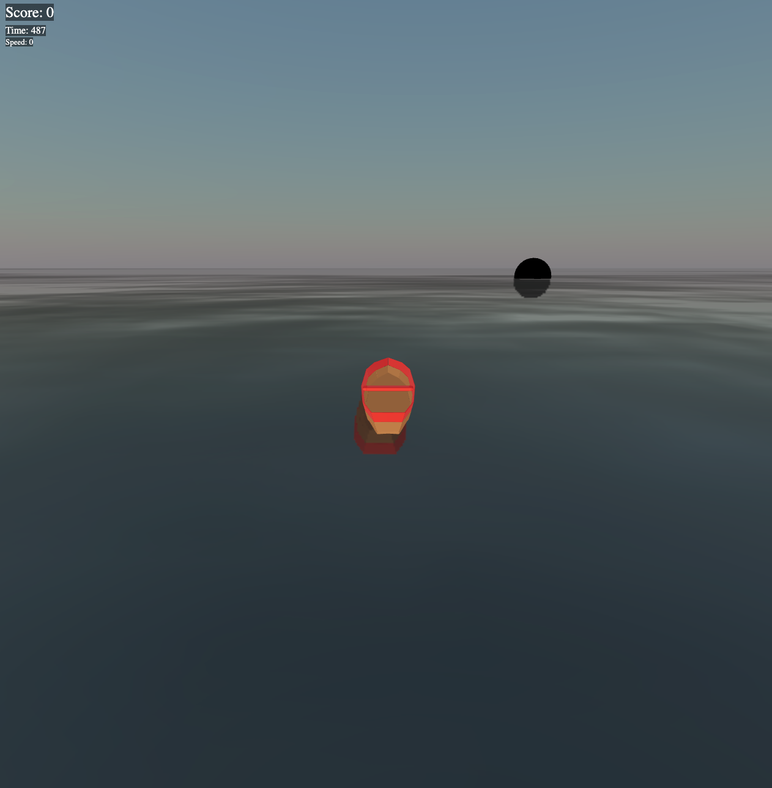

# Introduction

## Introduction - The power of Cloud Native on Oracle Cloud

This workshop is a valuable opportunity to enhance your cloud computing skills and learn how to build and deploy multiplayer applications in the cloud. With Cloud Native on Oracle Cloud, you'll discover the power of deploying a _`Three.js`_ application to the cloud, modernizing it, and enhancing it with immersive experiences.

_`Three.js`_ is a popular JavaScript library for creating 3D graphics and animations in web browsers, and there are other options available, such as _`Babylon.js`_ and _`A-Frame`_. The principles of 3D graphics and animation are transferable between these libraries, and the backend and concurrency management principles that are essential for Immersive applications are also applicable across all three libraries. Part 1 of this workshop will focus on _`Three.js`_, but we will cover other options in the future.

With _`Three.js`_ and Cloud Native on Oracle Cloud, you can create engaging immersive applications for your customers, employees, and partners. Whether it's virtual showrooms, immersive training simulations, product demonstrations, or games, _`Three.js`_ and Cloud Native on Oracle Cloud provide the scalability, performance, and availability you need to deliver immersive experiences.

Estimated Lab Time: 60 minutes

### Objectives
In this workshop, you will learn how to:

* Deploy a simple Three.js application to OCI Compute with Terraform, using Ansible to provide all requisite app configurations.

* Create container images of the application components and migrate them to OCI Container Images.

* Add _`Redis`_ and _`NginX`_ controller to your application to support scalability, while deploying to Oracle Container Engine for Kubernetes (OKE).

### Prerequisites

* An Oracle Free Tier or Paid Cloud Account
* [Familiarity with the OCI console](https://docs.oracle.com/en-us/iaas/Content/GSG/Concepts/console.htm)

* Basic familiarity with app containerization

* [Basic familiarity with OCI Container Instances](https://www.oracle.com/cloud/cloud-native/container-instances/)

* [Basic familiarity with OKE](https://www.oracle.com/cloud/cloud-native/container-engine-kubernetes/)

## Acknowledgements

* **Author** - Victor Martin - Technology Product Strategy Director - EMEA
* **Author** - Wojciech (Vojtech) Pluta - Developer Relations - Immersive Technology Lead
* **Author** - Eli Schilling - Developer Relations - Cloud Native and DevOps
* **Last Updated By/Date** - July, 2024