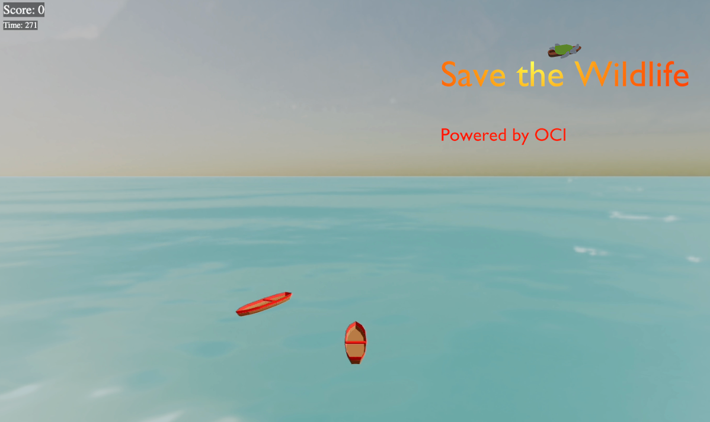

# Introduction

## Save The Wildlife - automated CI/CD release pipeline for gaming

## About this workshop.

In this workshop we will utilize an existing micro services app (Save the Wildlife) that is being built and deployed with automated scripts.

By migrating to a DevOps pipeline, attendees will see firsthand the benefits of fully automated app delivery in the cloud.

As the pace of innovation continues to accelerate, organizations must adopt Continuous Integration and Continuous Deployment strategies to keep up. The benefits of CI/CD not only provide speed and efficiency, but consistency and mitigation of human error.

_`Three.js`_ is a popular JavaScript library for creating 3D graphics and animations in web browsers, and there are other options available, such as _`Babylon.js`_ and _`A-Frame`_. The principles of 3D graphics and animation are transferable between these libraries, and the backend and concurrency management principles that are essential for Metaverse applications are also applicable across all three libraries. Part 1 of this workshop will focus on _`Three.js`_, but we will cover other options in the future.

With _`Three.js`_ and Cloud Native on Oracle Cloud, you can create engaging Metaverse applications for your customers, employees, and partners. Whether it's virtual showrooms, immersive training simulations, product demonstrations, or games, _`Three.js`_ and Cloud Native on Oracle Cloud provide the scalability, performance, and availability you need to succeed to deliver immersive experiences.

Estimated time: 60 minutes

### Objectives

In this lab, you will:

* Provisioning Infrastructure using IaC and OCI Resource Manager.
* Build and deploy a microservice based Three.JS onto OCI OKE.
* Bump and rollout new feature to your application.
* Clean up the infra.

### Prerequisites

1. An Oracle Free Tier(Trial), Paid or LiveLabs Cloud Account
1. [Familiarity with OCI console](https://docs.us-phoenix-1.oraclecloud.com/Content/GSG/Concepts/console.htm)
1. [Overview of Networking](https://docs.us-phoenix-1.oraclecloud.com/Content/Network/Concepts/overview.htm)
1. [OCI DevOps services.](https://docs.oracle.com/en-us/iaas/Content/devops/using/home.htm)

## Cloud Native Applications Overview

"Cloud native technologies empower organizations to build and run scalable applications in modern, dynamic environments such as public, private, and hybrid clouds. Containers, service meshes, microservices, immutable infrastructure, and declarative APIs exemplify this approach.

These techniques enable loosely coupled systems that are resilient, manageable, and observable. Combined with robust automation, they allow engineers to make high-impact changes frequently and predictably with minimal toil."

## Oracle DevOps

Oracle Cloud Infrastructure DevOps service provides an end-to-end CI/CD platform for developers. OCI DevOps services broadly cover all the essential needs for a software lifecycle. Such as

- OCI Deployment pipelines  – automate releases with declarative Pipeline release strategies to OCI Platforms like VM and Baremetals, Oracle Container Engine for Kubernetes (OKE) and OCI Functions
- OCI Artifact repositories – A place to store versioned artifacts, including immutable ones.
- OCI Code repositories – OCI provided a scalable code repository service.
- OCI Build pipelines – A serverless, scalable service to automate build, test, artefacts and deployment invocations.

You may now **proceed to the next lab**.

## Learn More

* [Reference Architecture: Understand modern app deployment strategies with Oracle Cloud Infrastructure DevOps ](https://docs.oracle.com/en/solutions/mod-app-deploy-strategies-oci/index.html)

## Acknowledgements

* **Author** - 
* **Contributors** -
* **Last Updated By/Date** - 