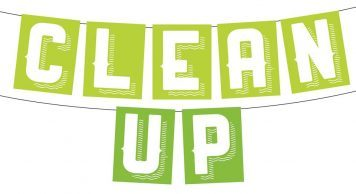

# Clean Up (optional)

## Destroy Infrastructure

All good things must come to an end... but only if you want them to. In this lab, you will destroy the resources we've created during this workshop.

Of course, if you'd like to continue to experiment, you can skip this part and leave everything running.



Estimated Lab Time: 10 minutes

### Prerequisites

* An Oracle Free Tier, Paid or LiveLabs Cloud Account


## Task 1: Remove Container Instance Components

1. Return to the OCI Cloud Shell.

2. Run the following command to locate the OCID of your Container Instances resource.

    ```
    <copy>oci container-instances container-instance list -c <compartment OCID> --display-name oci-MultiPlayer --auth api_key --config-file ~/.oci/config --profile WORKSHOP --query 'data.items[0].id' --raw-output</copy>
    ```

3. Copy the OCID into the following command to delete the Container Instance.

    ```
    <copy>oci container-instances container-instance delete --container-instance-id <container instance OCID> --auth api_key --config-file ~/.oci/conifg --profile WORKSHOP --force</copy>
    ```


## Task 2: Remove VM Compute Infrastructure

1. Ensure you are in the `devlive-save-the-wildlife` folder.

    ```
    <copy>cd ~/devlive-save-the-wildlife</copy>
    ```

2. Run the stop_VM script to tear everything down.

    ```
    <copy>./scripts/stop_VM.sh</copy>
    ```

3. Once that completes, it should remove all of the items deployed in **Lab 1**.


## Acknowledgements

* **Author** - Victor Martin - Technology Product Strategy Director - EMEA
* **Author** - Wojciech (Vojtech) Pluta - Developer Relations - Immersive Technology Lead
* **Author** - Eli Schilling - Developer Advocate - Cloud Native and DevOps
* **Last Updated By/Date** - March 21st, 2023
