# Provision the Infrastructure using Resource Manager

## Introduction

In this lab exercise, you will provide all the Infrastructure resources used by your applications through Infrastructure As Code (IaC) using [Terraform](https://www.terraform.io) on [Oracle Cloud Infrastructure Resource Manager service (ORM)](https://docs.oracle.com/en-us/iaas/Content/ResourceManager/Concepts/resourcemanager.htm).

If you are not familiar with Terraform, this is an open-source tool that allows you to write infrastructure as code using declarative configuration files that will represent the state of your infrastructure. OCI Resource Manager allows you to share and manage Terraform configurations and state files across multiple teams and platforms. You can connect Resource Manager to your Git repository by setting up a Configuration Source Provider.

Estimated time: 40 minutes

### Objectives

In this lab, you will:

* Create an IAM compartment to isolate and organize your CI/CD cloud resources
* Create ORM Stack and configuration pointing to a git repository.
* Provision Infrastructure: Network, IAM, OCI Container registry, OCI OKE and, DevOps elements.

### Prerequisites

* An Oracle Free Tier(Trial), Paid or LiveLabs Cloud Account
* GitHub account
* User that belongs to the Administrator group or has granted privileges to manage multiple OCI resources (IAM, ORM, DevOps, OKE, Network, etc).

## Task 1: Create VCN, ADB, and OKE Cluster with ORM 
1. Click on hamburger menu.

   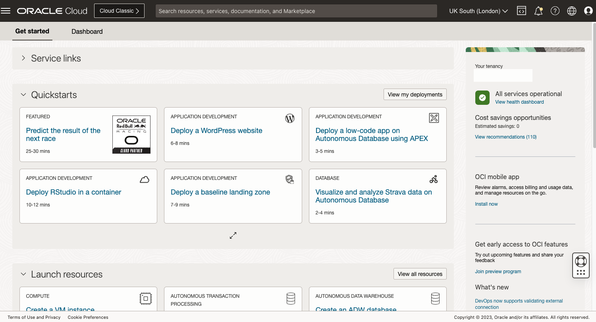

1. Open on Developer Services and under Resource Manager select Stacks
   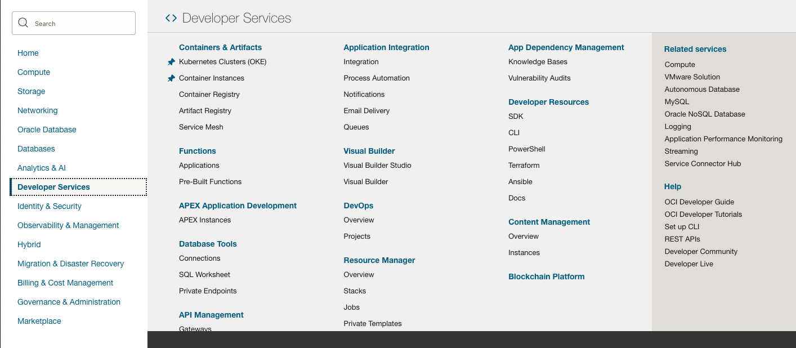

1. Click on create stack  
     

1. TODO: Download or zip Terraform folder  
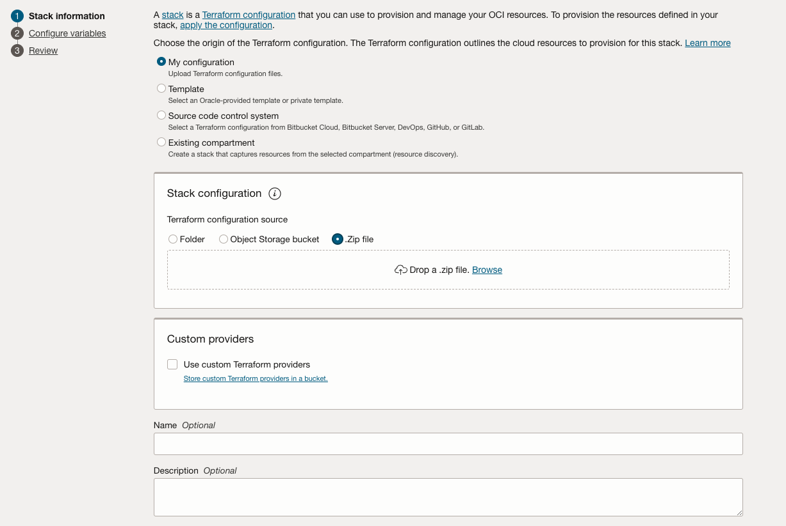  

1. Add your stack config  
  

1. Confirm Stack and Run Apply  
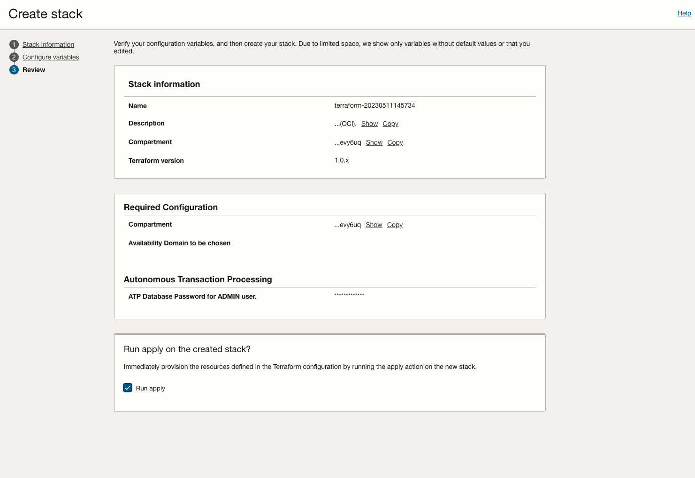  

1. Wait for stack to deploy
  

## Task 2: Create DevOPS project

1. Click on hamburger menu.

   

1. Open on Developer Services.
   

1. Under Devops click on Projects.
   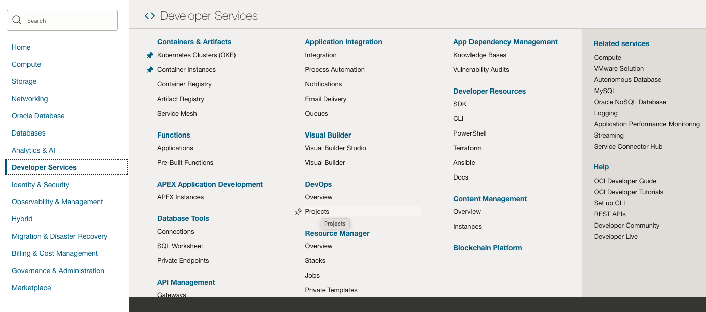

1. Click create new Project and give it a name
   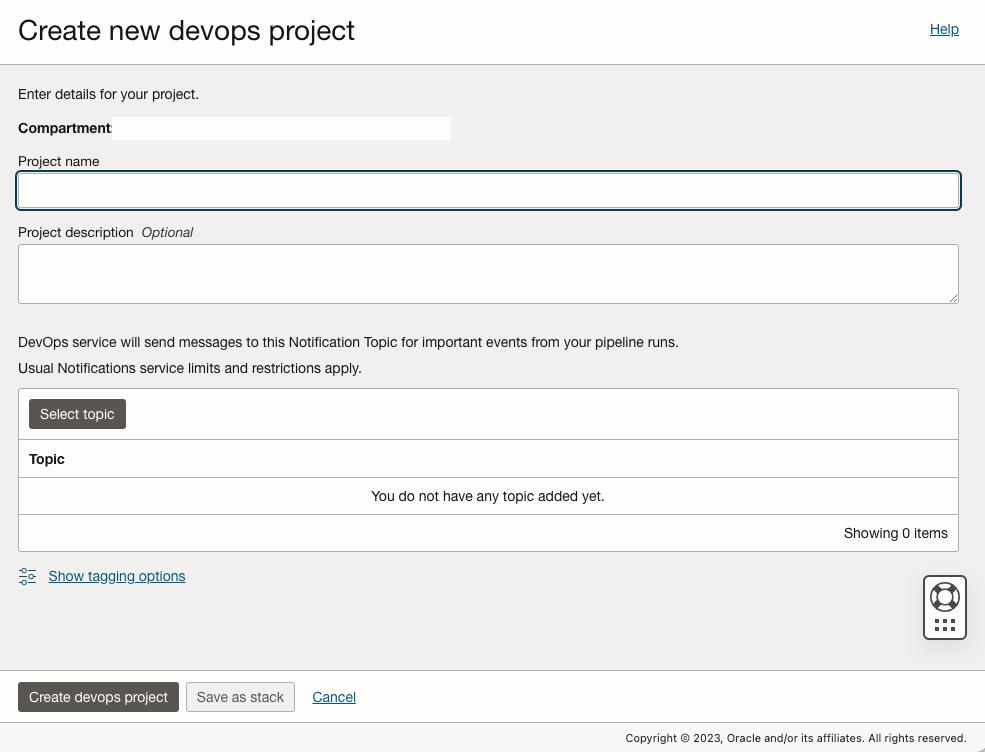

1. Select or create new project topic.
   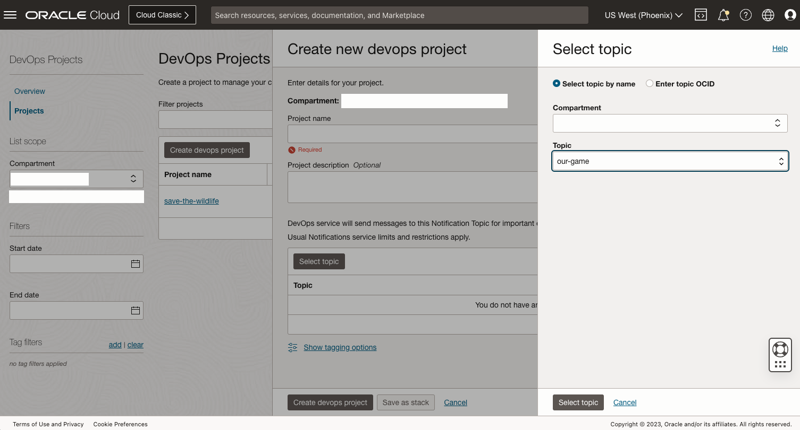

## Task 3: Create new repository

1. From Project Overview, click on Create repository
   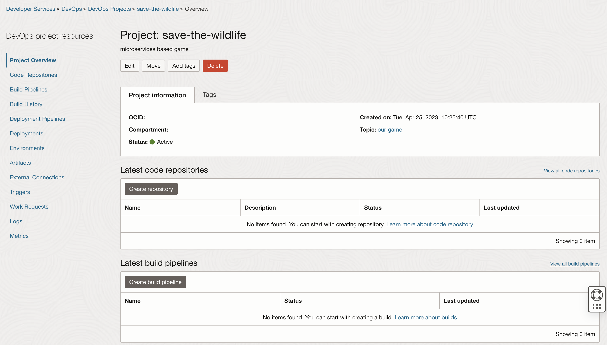

1. Fill Repository name and add description, confirm by clicking on Create repository.
   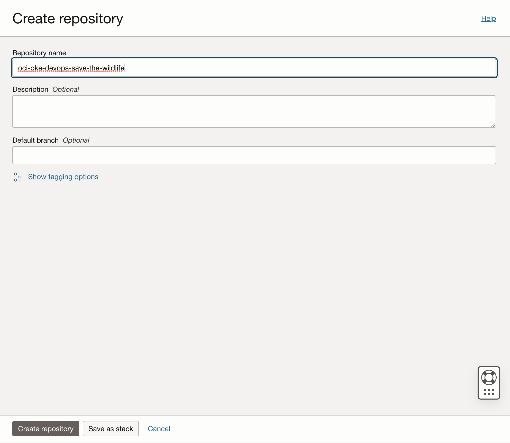

1. You should see our repository in latest code repositories section.
   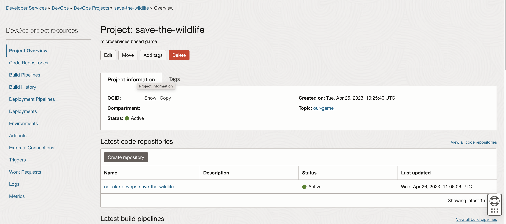


## Task 4: Commit local repository to Oracle DevOPS

You need an auth token to clone the repository using HTTPS.

1.  Open your repository by clicking on name
   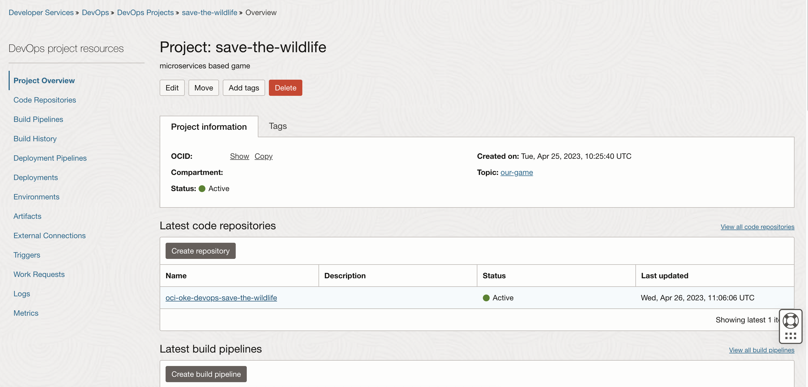

2.  Click on Clone
   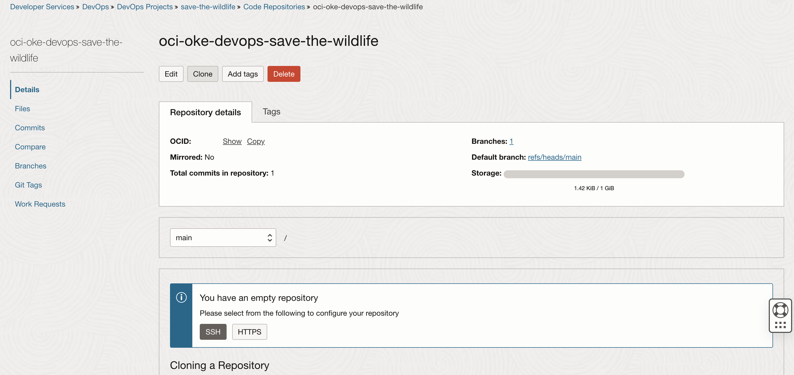

2.  Under Clone with HTTPS section, Click Copy
   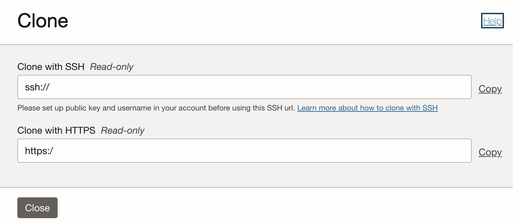

3.  In your local github client or in your CLI run
   ```
   <copy>git clone <PASTE CLONE WITH HTTPS></copy>
   ```  
   
To authenticate you must provide your username (with tenancy, optional federated identity and username) and password (auth token) when prompted.

For a federated user, enter the username in the following format: TenancyName/Federation/UserName. For example, if you use OCI's identity provider, your login would be, Acme/oracleidentitycloudservice/alice.jones@acme.com.

If you are using OCI's direct sign-in, enter the username in the following format: TenancyName/YourUserName. For example, Acme/alice_jones. Your password is the auth token you created previously.

4. In terminal enter your cloned repository  
   ```
   <copy>cd oci-oke-devops-save-the-wildlife</copy>
   ```

5. Download project file  
   ```
   <copy>wget https://github.com/oracle-devrel/oci-oke-appdev-save-the-wildlife/releases/download/mvp-v1/oci-oke-save-the-wildlife-latest.zip</copy>
   ```

6. TODO: Unzip project  
   ```
   <copy>unzip mvp.zip</copy>
   ```

7. Add content content to commit.  
   ```
   <copy>git add .</copy>
   ```

8. Commit your local repository.  
   ```
   <copy>git commit -a -m "project init"</copy>
   ```

8. Push your repository.  
   ```
   <copy>git push</copy>
   ```

You may now **proceed to the next lab**.

## Acknowledgements

* **Author** - Wojciech Pluta
* **Contributors** - Eli Schilling, Victor Martin
* **Last Updated By/Date** - 

