# Get to know OCI DevOps and related resources.

## Introduction
Estimated time: 20 minutes

### Objectives

In this lab, as a developer or SRE,

## Task 1: Upload Artifacts to your Artifact Repository

1. From hamburger menu navigate to Artifact Repository.

   

1. Click _Create repository_.

   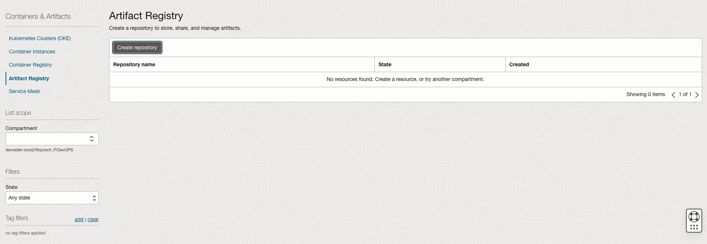

1. You can leave default values or change it as you wish. Click _Create_

   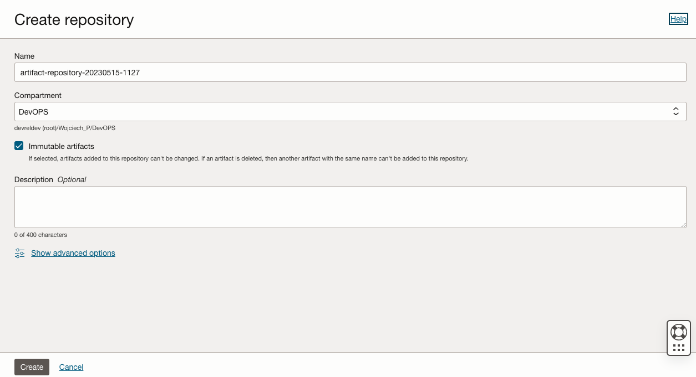

1. Once repository created click _Upload Artifact_

   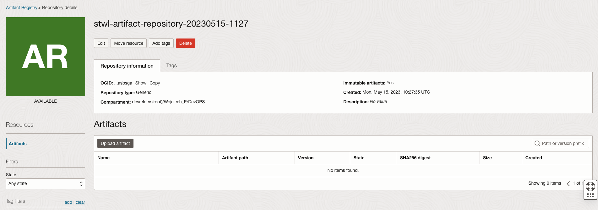

1. Add manifest file and update it's path and version, confirm by clicking on _Upload_

   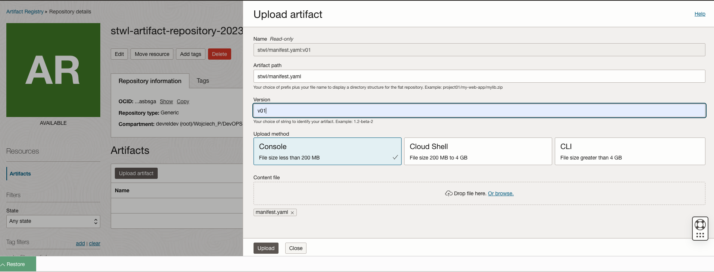

1. You manifest will be displayed in the Artifact section
   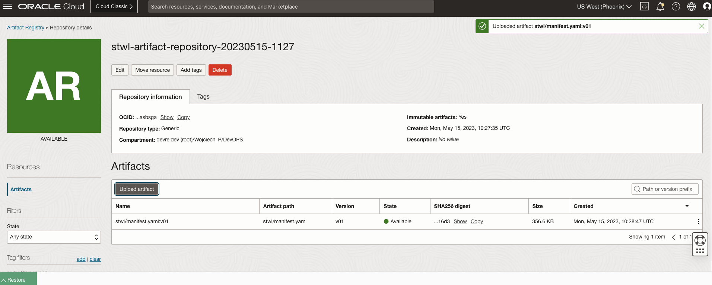


You may now **proceed to the next lab**.

## Task 2: Seting up build pipeline
1. From project home page navigate to _Build Pipelines_.
2. Click _Create build pipeline_
      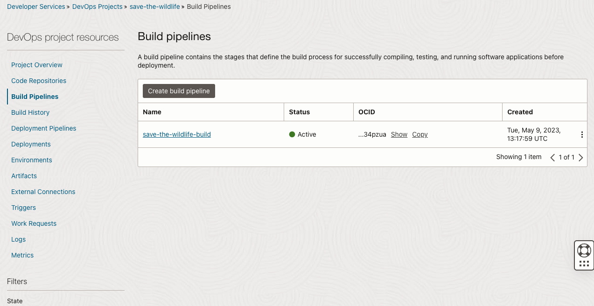
3. Name your build pipeline and press _Create_
      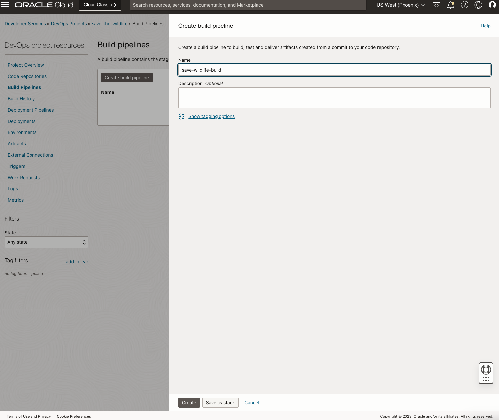
4. Click on newly create pipeline
      
5. Select add stage
      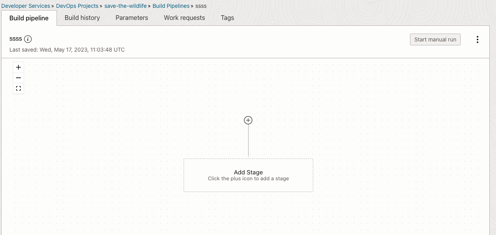
6. Select _Managed Build_
      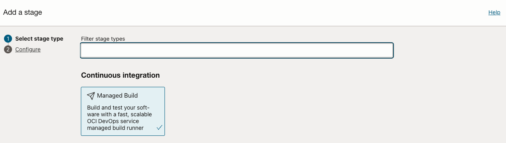
7. Update _Stage name_ field: `web and server`
      
8.  Click the "Build spec file path" field and add reference to build manifest that is located in root of our repo `build_spec_web_server.yaml` 

      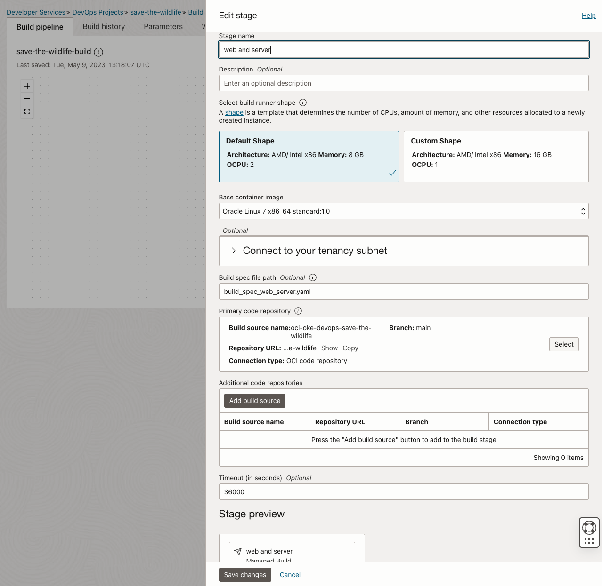
Here is a snapshot of build file for reference
```yaml
version: 0.1
component: build
timeoutInSeconds: 6000
runAs: root
shell: /bin/sh
env:
  variables:
  vaultVariables:
  exportedVariables:
    - BUILDRUN_HASH

steps:
  - type: Command
    name: "Define unique image tag"
    timeoutInSeconds: 40
    command: |
      export BUILDRUN_HASH=`echo ${OCI_BUILD_RUN_ID} | rev | cut -c 1-7`
      echo "BUILDRUN_HASH: " $BUILDRUN_HASH
  - type: Command
    name: "Build Web"
    command: |      
      cd web/
      docker build -t web .
  - type: Command
    name: "Build Server"
    command: |      
      cd server/
      docker build -t server .

outputArtifacts:
  - name: oke_stwl_web
    type: DOCKER_IMAGE
    location: web:latest
  - name: oke_stwl_server
    type: DOCKER_IMAGE
    location: server:latest
```
1. Under _Primary code repository_ click select
      
2. Select Source: Connection type `OCI Code Repository`
      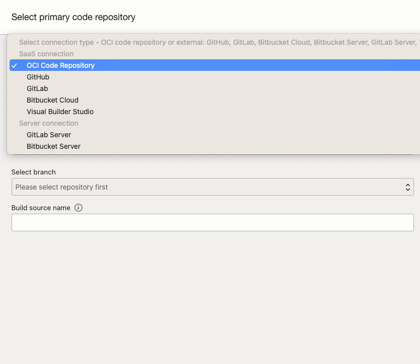

3.  Tick checkbox, select main branch and click _Select_ at the bottom of the page
      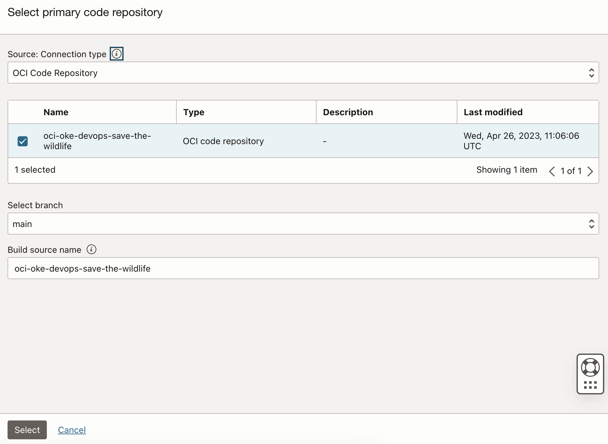

4.  Finalise creation of this stage by clicking _Add_
5.  From web and server click plus icon and select _Add Stage_
      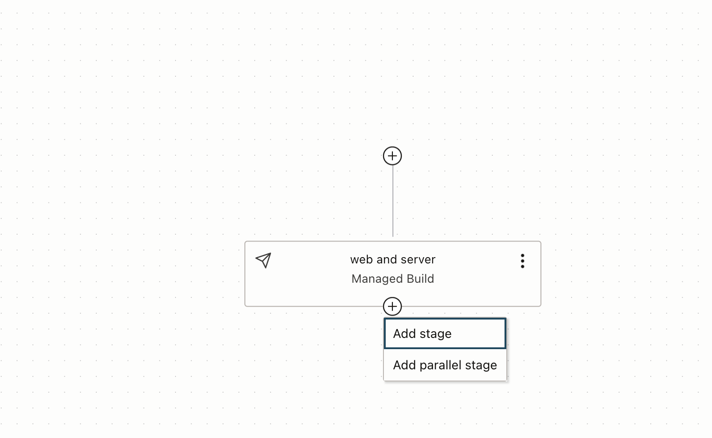

1.  Change from _Managed Build_ to _Deliver artifacts_ and click _Next_
      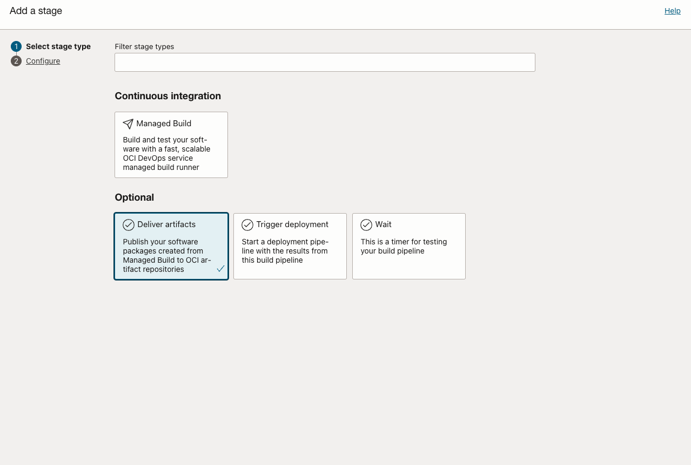

2.  Input stage name: `Deliver Artifacts`
      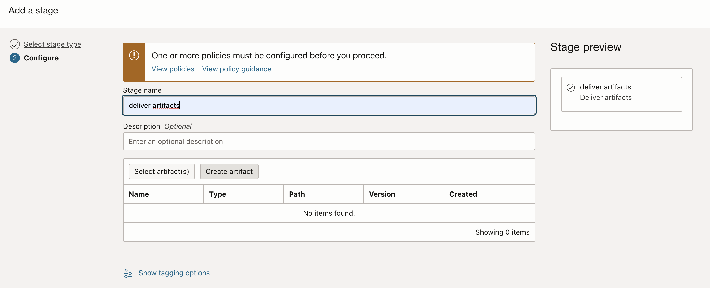

3.  Click create artifact

4.  Add name: `web`
      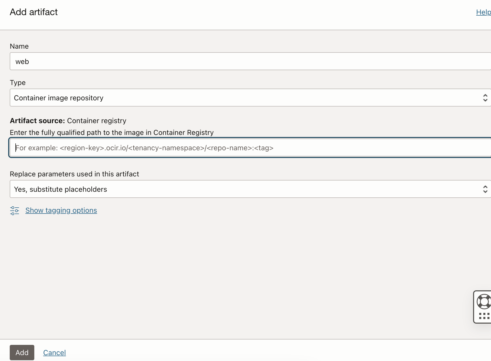
6.  Input Artifact source path `<OCI Region>.ocir.io/<NAMESPACE>/web:${BUILDRUN_HASH}`
7.  Click _Add_
8.  Repeat the above process for server
9.  In build config add `oke_stwl_web` for web and `oke_stwl_server` for server. These should match our build manifest _outputArtifacts_ names
```yaml  
outputArtifacts:
  - name: oke_stwl_web
    type: DOCKER_IMAGE
    location: web:latest
  - name: oke_stwl_server
    type: DOCKER_IMAGE
    location: server:latest
```
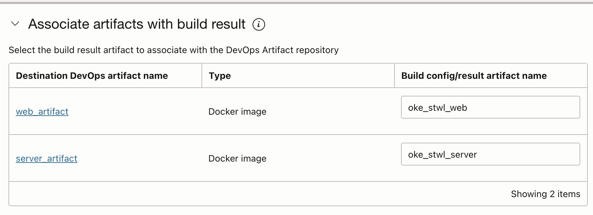


## Acknowledgements

* **Author** - 
* **Contributors** -
* **Last Updated By/Date** -